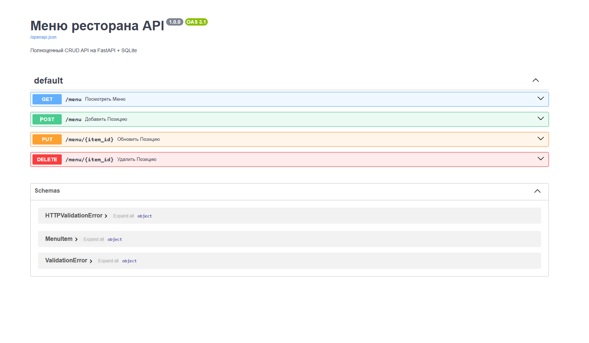

# Ресторанное меню API (FastAPI + SQLite)

**Простое и быстрое REST API** для управления меню ресторана.  
Поддерживает **полный CRUD** с базой данных SQLite.

> **Готово к использованию**: запускается за 10 секунд, есть Swagger UI, стартовые данные.  
> **Live-демо**: [https://api-vkusno.onrender.com/docs](https://api-vkusno.onrender.com/docs)

---

## Функционал

| Метод | Эндпоинт | Описание |
|-------|----------|---------|
| **GET** | `/menu` | Получить всё меню |
| **POST** | `/menu` | Добавить новое блюдо *(без `id` — генерируется автоматически)* |
| **PUT** | `/menu/{id}` | Обновить блюдо по ID |
| **DELETE** | `/menu/{id}` | Удалить блюдо |

---

## Технологии

- **Python 3.13**
- **FastAPI** — современный веб-фреймворк
- **SQLAlchemy + SQLite** — ORM и база данных
- **Pydantic** — валидация данных
- **JWT аутентификация** *(в процессе добавления)*
- **Swagger UI** — интерактивная документация

---

## Быстрый старт
### 1. Клонировать репозиторий
git clone https://github.com/DPakhota/API_vkusno.git
cd API_vkusno

### 2. Установить зависимости
pip install -r requirements.txt

### 3. Запустить сервер
uvicorn main:app --reload
Сервер доступен по адресу:
http://127.0.0.1:8000

Swagger UI (документация)
Локально:
http://127.0.0.1:8000/docs
Live-демо (онлайн):
https://api-vkusno.onrender.com/docs

Примеры запросов
Добавить блюдо (POST /menu)
json{
  "name": "Шаурма",
  "description": "С курицей, овощами и соусом",
  "price": 350.0
}

Важно: id не передаётся — генерируется автоматически.

Обновить блюдо (PUT /menu/1)
json{
  "name": "Стейк рибай (премиум)",
  "description": "Сочное ребро, 100 г, с соусом",
  "price": 600.0
}

Ошибки

404 — если блюдо не найдено:
json{ "detail": "Item not found" }

Структура проекта
textAPI_vkusno/
├── main.py             # Основной код API
├── requirements.txt    # Зависимости
├── database.db         # База данных (создаётся автоматически)
├── swagger.png         # Скриншот документации
├── .gitignore          # Игнорируем БД и кэш
└── README.md           # Эта инструкция

Разработчик
Дмитрий — junior backend-разработчик

Перешёл из су-шефа в IT за 3 дня
Упорство, дисциплина, результат

Готов к заказам:

от 15 000 тенге
срок: 1-3 дня

Контакты

Kwork: kwork.ru/user/dpakhota
Email: dpakhota@mail.com
Telegram: @DPakhota (отвечаю быстро!)

Готов взять ваш проект!
Пишите — обсудим детали, сделаю тестовое задание.